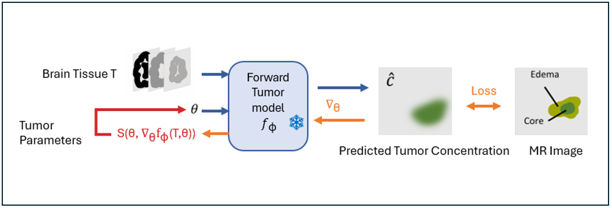
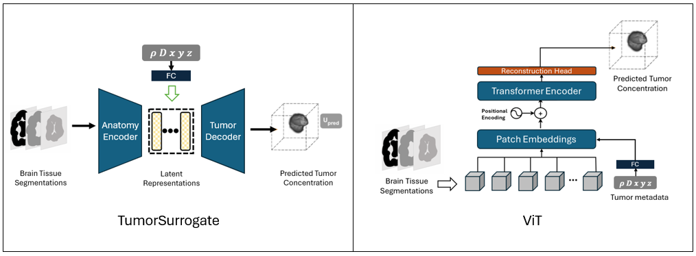

# TumorNetSolvers: A Deep Learning Framework for Personalized PDE-Based Tumor Growth Modeling

**TumorNetSolvers** is an adaptive deep learning framework designed for efficient personalization of PDE-based tumor growth models, with a focus on simulating and predicting tumor evolution. Built on the powerful nnU-Net framework, this project leverages state-of-the-art neural architectures to address both **forward** and **inverse** tumor modeling problems.

### Table of Contents:
1. [Overview](#overview)  
2. [Core Concepts](#core-concepts)  
3. [Model Architecture](#model-architecture)  
4. [Usage](#usage)  
5. [Installation](#installation)  
7. [Contributing](#contributing)  
8. [License](#license)  
9. [References](#references)  

---

## Overview

TumorNetSolvers provides a flexible and efficient solution for simulating tumor growth in 3D using **Partial Differential Equations (PDEs)**, specifically the Fisher-Kolmogorov equation. It personalizes the model for individual patients by inferring **tumor growth parameters** (diffusion coefficient, growth rate, initial location) from MRI scans or similar medical images.  


### Forward Problem
- **Input**: A 3D medical image (e.g., brain tissue segmentations) and tumor parameters (growth rate, diffusion coefficient, tumor location).  
- **Output**: A 3D simulation of tumor corresponding to that anatomy info and those tumor parameters  

### Inverse Problem
- **Input**: A target tumor simulation (e.g., MRI-based 3D tumor image).  
- **Goal**: Infer tumor parameters by optimizing the model to match the target simulation.

Below is a diagram illustrating the **Inverse Problem**:  



## Core Concepts


1. **PDE-based Tumor Growth Modeling**:  
   TumorNetSolvers is trained on the Fisher-Kolmogorov equation to model brain tumor cell dynamics over time and space:

   $$ \frac{\partial c}{\partial t} = \nabla \cdot (D \nabla c) + \rho c(1 - c) $$

   Where:
   - \( c(x, t) \) is the tumor cell concentration,
   - \( D \) is the diffusion coefficient,
   - \( \rho \) is the growth rate,
   - \( \nabla \cdot (D \nabla c) \) is the diffusion term,
   - \( \rho c(1 - c) \) models logistic growth, limiting \( c \) as it approaches 1.

   TumorNetSolvers uses deep learning to approximate this PDE's solutions but can in theory be used on PDE-based models (as the framework is adaptable to different input shapes and tumor parameter sizes).


2. **Deep Learning Surrogate Models**:  
   Neural networks approximate the PDE solution, mapping input (image + parameters) to output (simulation).  

3. **Built on nnU-Net**:  
   The framework builds upon nnU-Net's self-configuring capabilities, adapting it for conditioned image-to-image regression tasks.  

---

## Model Architecture

  
TumorNetSolvers includes three key models:  

1. **TumorSurrogate (Baseline)**:
   - A 3D CNN that integrates anatomy info and tumor metadata for conditioned tumor simulation.  
   See above diagram illustrating the **TumorSurrogate Architecture (CNN)**:  

2. **Modified nnU-Net**:  
   - A adapted version of nnU-Net for tumor growth simulation using conditioned inputs.  

3. **3D Vision Transformer (ViT)**:  
   - A transformer-based model incorporating tumor metadata as additional input token in embedding space.  
   See above diagram illustrating the **ViT Architecture**:  
---

## Usage

For detailed usage, please refer to the scripts in the [scripts directory](scripts/) or follow the instructions below:

1. **Forward Problem**: Run the script `running_inference.py` with the necessary inputs (3D medical image, tumor parameters) to generate tumor simulations.
   
2. **Inverse Problem**: Run the script `predict_tumor_params.py` to infer tumor parameters by optimizing against a target tumor simulation.


## Installation

To get started with **TumorNetSolvers**, you can install it directly from GitHub by following these steps:

1. Clone the repository:
    ```bash
    git clone https://github.com/ZeinebZH/tumornetsolvers.git
    cd tumornetsolvers
    ```

2. Install the required dependencies and the package:
    ```bash
    pip install -r requirements.txt
    pip install .
    ```

## Contributing

We welcome contributions to **TumorNetSolvers**!  

## License

This project is licensed under the MIT License and incorporates code from nnU-Net, licensed under Apache 2.0. Both licenses apply and must be respected. See the [LICENSE](LICENSE) file for details.  

---

## References

1. Weidner J, Ezhov I, Balcerak M, Menze B, Wiestler B. Rapid Personalization of PDE-Based Tumor Growth Using a Differentiable Forward Model. Medical Imaging with Deep Learning. 2024. [Link](https://openreview.net/pdf?id=7SMswKSKIX)  
2. Ezhov I, Mot T, Shit S, Lipkova J, Paetzold JC, Kofler F, et al. Geometry-aware Neural Solver for Fast Bayesian Calibration of Brain Tumor Models. IEEE Transactions on Medical Imaging. 2021;41(5):1269–78. [Link](https://ieeexplore.ieee.org/abstract/document/9656125)  
3. Isensee F, Jaeger PF, Kohl S, Petersen J, Maier-Hein KH. nnU-Net: A Self-configuring Method for Deep Learning-based Biomedical Image Segmentation. Nature Methods. 2021;18(2):203–11. [DOI](https://www.nature.com/articles/s41592-020-01008-z)  
4. Lin K, Heckel R. Vision Transformers Enable Fast and Robust Accelerated MRI. International Conference on Medical Imaging with Deep Learning. 2022. [Link](https://proceedings.mlr.press/v172/lin22a.html)


